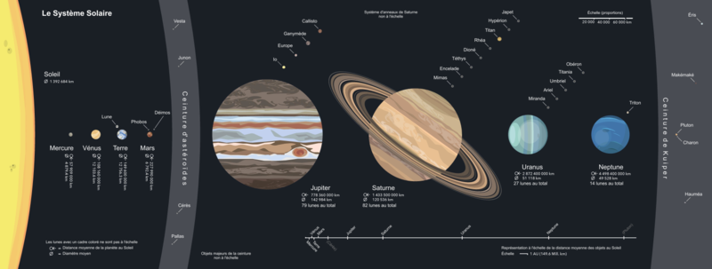

# Introduction

Ce chapitre présente les planètes du système solaire.

## Vue d'ensemble

Sur l'image suivante, le Soleil, les planètes, les planètes naines et les satellites naturels sont à l'échelle pour leurs tailles relatives, et non pour les distances.

Les lunes sont répertoriées près de leurs planètes par ordre croissant d'orbites (seules les plus grandes lunes pour chaque planète sont indiquées).

## Pour aller plus loin

:::tip Wikipedia
[Système solaire](https://fr.wikipedia.org/wiki/Système_solaire)
:::
