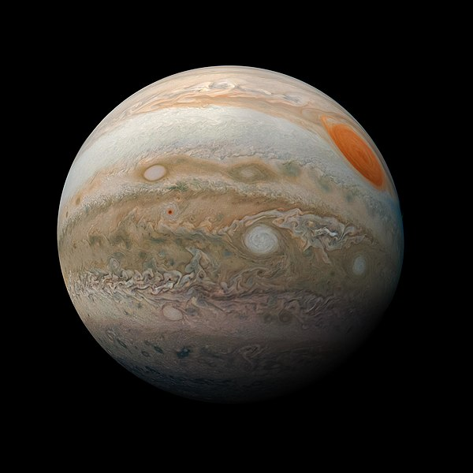

# Jupiter

<!-- Imports éventuels pour composants à placer juste en dessous -->
import { PlotPie } from "../../src/components/Plot";

Jupiter est la cinquième planète du Système solaire par ordre d'éloignement au Soleil, et la plus grande par la taille et la masse devant Saturne, qui est comme elle une [planète géante gazeuse](../glossaire/gazeuse). Elle est même plus volumineuse que toutes les autres planètes réunies avec son rayon moyen de 69 911 km, qui vaut environ onze fois celui de la Terre, et sa masse qui est 318 fois plus grande.

Photographie de la planète Jupiter, prise par Juno

## Origine du nom

Son nom vient du dieu romain Jupiter, qui gouverne la terre et le ciel et tous les êtres vivants qui s'y trouvent.

Le symbole astronomique de la planète est « ♃ », qui serait une représentation stylisée du foudre de Jupiter

## L'atmosphère

L'atmosphère de Jupiter est la plus importante des atmosphères des planètes du système solaire. Elle est composée principalement de d'hydrogène et d'hélium. Les autres composants chimiques sont présents seulement en petite quantité, dont le méthane, l'ammoniac, le sulfure d'hydrogène et l'eau. Ce dernier composant n'a pas été observé directement mais il se trouverait dans les profondeurs de l'atmosphère.

L'atmosphère de Jupiter se caractérise par l'absence de limite inférieure précise et se mélange graduellement aux fluides intérieurs de la planète.

<PlotPie
  title="Composition volumétrique de l'atmosphère"
  width={400}
  height={400}
  hoverinfo="label+percent"
  labels={[
    "Dihydrogène",
    "Hélium",
    "Méthane",
    "Vapeur d'eau",
    "Ammoniac",
  ]}
  values={[86.0, 13.0, 0.1, 0.1, 0.02 ]}
></PlotPie>

## Pour aller plus loin

:::tip Wikipedia
[Jupiter](https://fr.wikipedia.org/wiki/Jupiter_(planète))
:::

