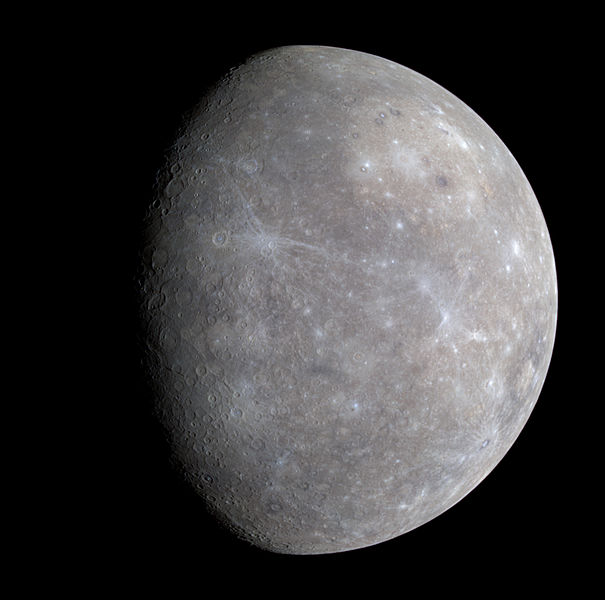

# Mercure

Mercure est la planète la plus proche du Soleil et la moins massive du Système solaire.

Son éloignement au Soleil est compris entre 0,31 et 0,47 unité astronomique (soit 46 et 70 millions de kilomètres), ce qui correspond à une excentricité orbitale de 0,2 — plus de douze fois supérieure à celle de la Terre, et de loin la plus élevée pour une planète du Système solaire. Elle est visible à l'œil nu depuis la Terre avec un diamètre apparent de 4,5 à 13 secondes d'arc, et une magnitude apparente de 5,7 à −2,3 ; son observation est toutefois rendue difficile par son élongation toujours inférieure à 28,3° qui la noie le plus souvent dans l'éclat du soleil. En pratique, cette proximité avec le soleil implique qu'elle ne peut être vue que près de l'horizon occidental après le coucher du soleil ou près de l'horizon oriental avant le lever du soleil, en général au crépuscule. Mercure a la particularité d'être en résonance spin-orbite 3:2, sa période de révolution (~88 jours) valant exactement 1,5 fois sa période de rotation (~59 jours), et donc la moitié d'un jour solaire (~176 jours). Ainsi, relativement aux étoiles fixes, elle tourne sur son axe exactement trois fois toutes les deux révolutions autour du Soleil.

Mercure est une [planète tellurique](../glossaire/tellurique), comme le sont également Vénus, la Terre et Mars. Elle est près de trois fois plus petite et presque vingt fois moins massive que la Terre mais presque aussi dense qu'elle. Sa densité remarquable est due à l'importance de son noyau métallique, qui représenterait 85 % de son rayon, contre environ 55 % pour la Terre.

Photographie de Mercure par la sonde Messenger en 2008

## Origine du nom

La planète Mercure doit son nom au messager des dieux dans la mythologie romaine, Mercure.

La planète est nommée ainsi par les Romains à cause de la vitesse avec laquelle elle se déplace dans le ciel. Le symbole astronomique de Mercure est un cercle posé sur une croix et portant un demi-cercle en forme de cornes (Unicode : ☿). Il s'agit d'une représentation du caducée du dieu Hermès, équivalent de Mercure dans la mythologie grecque.

## Pour aller plus loin

:::tip Wikipedia
[Mercure](https://fr.wikipedia.org/wiki/Mercure_(planète))
:::
