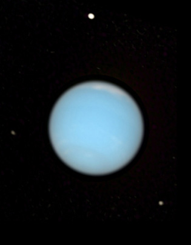

# Neptune

Neptune est la huitième planète par ordre d'éloignement au Soleil et la plus éloignée connue du Système solaire. 

Elle orbite autour du Soleil à une distance d'environ 30,1 UA (4,5 milliards de kilomètres), avec une excentricité orbitale moitié moindre que celle de la Terre et une période de révolution de 164,79 ans. 

Il s'agit de la troisième planète la plus massive du Système solaire et de la quatrième plus grande par la taille — un peu plus massive mais un peu plus petite qu'Uranus. Par ailleurs, elle est la planète géante la plus dense. 

  
Vue en couleurs réelles de Neptune avec Protée (en haut), Larissa (en bas à droite) et Despina (à gauche), depuis le télescope spatial Hubble

## Origine du nom

La planète porte le nom de Neptune, dieu des mers dans la mythologie romaine, et a pour symbole astronomique ♆, une version stylisée du trident du dieu. 

## Pour aller plus loin

:::tip Wikipedia
[Neptune](https://fr.wikipedia.org/wiki/Neptune_(planète))  
:::

