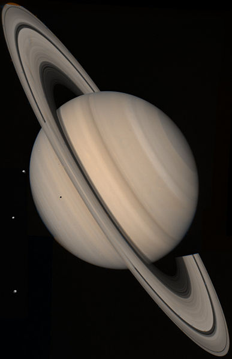

# Saturne

Saturne est la sixième planète du Système solaire par ordre d'éloignement au Soleil, et la deuxième plus grande par la taille et la masse après Jupiter, qui est comme elle une [planète géante gazeuse](../glossaire/gazeuse). Son rayon moyen de 58 232 km est environ neuf fois et demi celui de la Terre et sa masse est 95 fois plus grande. Orbitant en moyenne à environ 1,4 milliard de kilomètres du Soleil (9,5 unités astronomiques), sa période de révolution vaut un peu moins de 30 années tandis que sa période de rotation est estimée à 10 h 33 min. 

La caractéristique la plus célèbre de la planète est son système d'anneaux proéminent, composés principalement de particules de glace et de poussières.

  
Image de Saturne par Voyager 2 en 1981 

## Origine du nom

Le nom de Saturne vient de celui du dieu romain du même nom, qui est dieu du temps et de la mort. Pour les Grecs, Saturne s'appelle Cronos. 

Son symbole astronomique ♄ représente la faucille du dieu. 

## Pour aller plus loin

:::tip Wikipedia
[Saturne](https://fr.wikipedia.org/wiki/Saturne_(planète))  
:::

