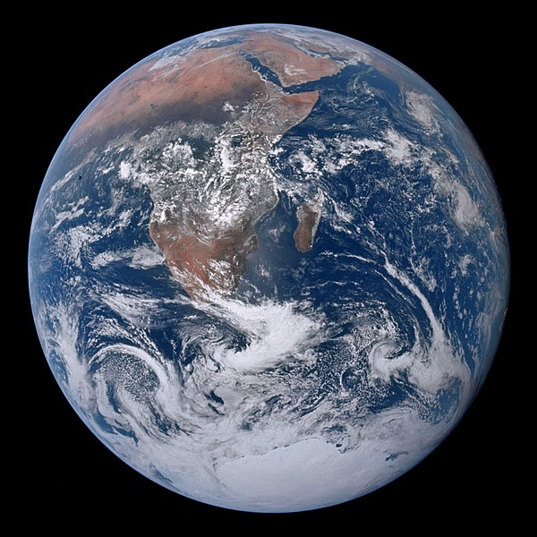

# Terre

La Terre est la troisième planète par ordre d'éloignement au Soleil et la cinquième plus grande du Système solaire aussi bien par la masse que le diamètre. Par ailleurs, elle est le seul objet céleste connu pour abriter la vie. Elle orbite autour du Soleil en 365,256 jours solaires — une année sidérale — et réalise une rotation sur elle-même relativement au Soleil en 23 h 56 min 4 s — un jour sidéral — soit un peu moins que son jour solaire de 24 h du fait de ce déplacement autour du Soleil. L'axe de rotation de la Terre possède une inclinaison de 23°, ce qui cause l'apparition des saisons. 

D'après la datation radiométrique, la Terre s'est formée il y a 4,54 milliards d'années. Elle possède un unique satellite naturel, la Lune, qui s'est formée peu après.

  
Photographie prise par l'équipage d'Apollo 17 en 1972

## Origine du nom

Le nom de la Terre s'apparente à Terra, déesse romaine de la terre. La Terre est parfois appelée Gaïa, en souvenir de la déesse grecque de la fertilité de la terre et du sol. Du fait de l’étendue des océans et mers, la Terre est aussi surnommée la planète bleue (couleur très visible depuis l’espace). 

## Pour aller plus loin

:::tip Wikipedia
[Terre](https://fr.wikipedia.org/wiki/Terre)  
:::

