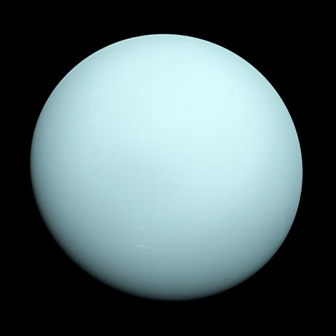

# Uranus

<!-- Imports éventuels pour composants à placer juste en dessous -->
import { PlotPie } from "../../src/components/Plot";

Uranus est la septième planète du Système solaire par ordre d'éloignement au Soleil. Elle orbite autour de celui-ci à une distance d'environ 19,2 unités astronomiques (2,87 milliards de kilomètres), avec une période de révolution de 84,05 années terrestres.

Il s'agit de la quatrième planète la plus massive du Système solaire et de la troisième plus grande par la taille.

Uranus vue par la sonde Voyager 2 en 1986

## Origine du nom

Son nom vient d'Ouranos, divinité grecque du ciel (Uranus dans la mythologie romaine), père de Cronos (Saturne) et grand-père de Zeus (Jupiter).

Uranus possède deux symboles astronomiques. Le premier à être proposé est ♅ qui représente le H de William Herschel, le découvreur de la planète.

## L'atmosphère

L'atmosphère d'Uranus, comme celle de Neptune, est différente des deux autres géantes gazeuses, Jupiter et Saturne. Bien que principalement composée comme elles d'hydrogène et d'hélium, elle possède une plus grande proportion de gaz volatils tels que l'eau, l'ammoniac et le méthane.

<PlotPie
  title="Composition volumétrique de l'atmosphère"
  width={400}
  height={400}
  hoverinfo="label+percent"
  labels={[
    "Dihydrogène",
    "Hélium",
    "Méthane",
    "Ammoniac",
  ]}
  values={[83.0, 15.0, 1.99, 0.01 ]}
></PlotPie>

## Pour aller plus loin

:::tip Wikipedia
[Uranus](https://fr.wikipedia.org/wiki/Uranus_(planète))
:::

