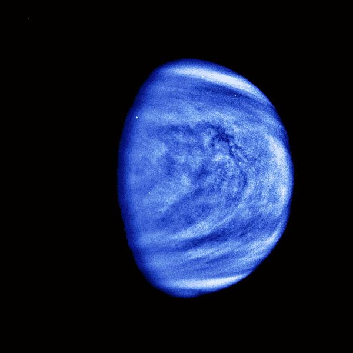

# Vénus

<!-- Imports éventuels pour composants à placer juste en dessous -->
import { PlotPie } from "../../src/components/Plot";

Vénus est la deuxième planète du Système solaire par ordre d'éloignement au Soleil, et la sixième plus grosse aussi bien par la masse que le diamètre.

Vénus orbite autour du Soleil tous les 224,7 jours terrestres. Avec une période de rotation de 243 jours terrestres, il lui faut plus de temps pour tourner autour de son axe que toute autre planète du Système solaire. Comme Uranus, elle possède une rotation rétrograde et tourne dans le sens opposé à celui des autres planètes : le soleil s'y lève à l'ouest et se couche à l'est. Vénus possède l'orbite la plus circulaire des planètes du Système solaire avec une excentricité orbitale presque nulle et, du fait de sa lente rotation, est quasiment sphérique. Elle ne possède pas de satellite naturel.

Vénus est l'une des quatre planètes telluriques du Système solaire. Elle est parfois appelée la « planète sœur » de la Terre en raison des similitudes relatives de leurs diamètres, masses, proximités au Soleil et compositions.

Photographie prise par la sonde Galileo en 1990

## Origine du nom

Vénus doit son nom à la déesse de l'amour, dans la mythologie romaine (assimilée à l'Aphrodite de la mythologie grecque).

Le symbole astronomique de Vénus est le même que celui utilisé en biologie pour le sexe féminin : un cercle avec une croix pointant vers le bas (Unicode : ♀)

## L'atmosphère

Vénus est la planète la plus chaude du Système solaire du fait de son atmosphère beaucoup plus dense que l'atmosphère terrestre.

L'atmosphère de Vénus est principalement composée de dioxyde de carbone, avec un peu d'azote et des traces d'autres composés.
La quantité d'azote dans l'atmosphère est relativement faible par rapport à la quantité de dioxyde de carbone, mais puisque l'atmosphère vénusienne est plus épaisse que l'atmosphère terrestre, la quantité d'azote totale est quatre fois supérieure à celle de la Terre (où l'azote représente 78 % de l'atmosphère)

<PlotPie
  title="Composition volumétrique de l'atmosphère"
  width={400}
  height={400}
  hoverinfo="label+percent"
  labels={[
    "Dioxyde de carbone",
    "Diazote",
  ]}
  values={[96.5, 3.5]}
/>

## Pour aller plus loin

:::tip Wikipedia
[Vénus](https://fr.wikipedia.org/wiki/Vénus_(planète))
:::

